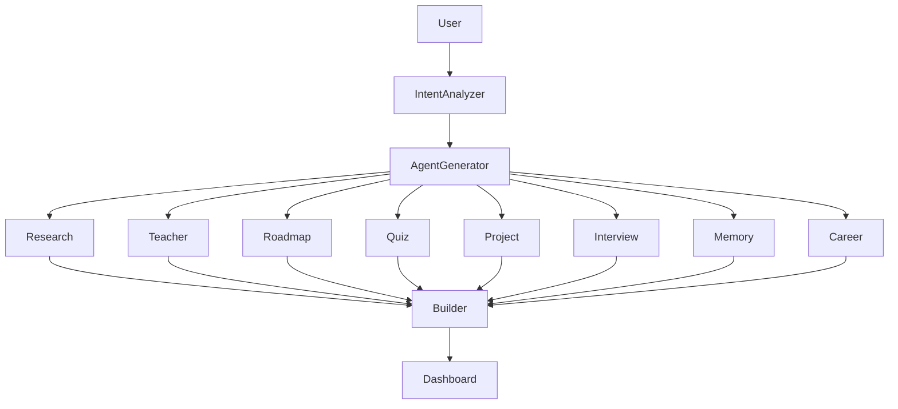
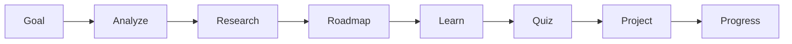
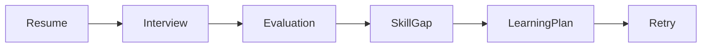

# 🚀 FOCUS
## AI Career Learning Operating System

> **Learn • Practice • Interview • Improve • Get Hired**


---

## 🌟 Overview

**FOCUS** is an AI-powered Career Learning Operating System that combines personalized learning with intelligent mock interviews. Unlike traditional learning platforms, FOCUS creates a continuous improvement loop where specialized AI agents collaborate to teach, evaluate, and guide learners toward career readiness.

---

# ❗ Problem Statement

Students today use separate tools for:
- Learning concepts
- Finding resources
- Practicing quizzes
- Preparing projects
- Taking mock interviews
- Tracking progress

This fragmented workflow leads to poor personalization and inefficient learning.

---

# 💡 Our Solution

FOCUS unifies the complete learning journey into one AI-powered platform.

A dynamic Multi-Agent Orchestrator creates specialist AI agents on demand. These agents collaborate to deliver personalized learning, adaptive assessments, mock interviews, and career guidance.

---

# 🎯 Core Features

## 📚 Learning Hub
- Personalized learning roadmap
- AI Tutor
- Adaptive quizzes
- Project recommendations
- RAG-powered document Q&A
- Resource finder
- Learning analytics

## 🎤 Mock Interview Hub
- HR interviews
- Technical interviews
- Voice interaction
- AI evaluation
- Strength & weakness analysis
- Personalized improvement plan

## 📊 Career Dashboard
- Skill tracking
- Learning history
- Interview readiness
- Placement readiness
- Mission progress

---

# 🧠 Multi-Agent Architecture



---

# 🛣️ End-to-End Workflow

```text
Login
  ↓
Dashboard
  ↓
Choose Career Goal
  ↓
Intent Analyzer
  ↓
Dynamic Agent Generator
  ↓
Research Agent
Teacher Agent
Roadmap Agent
Quiz Agent
Project Agent
Interview Agent
Memory Agent
Career Agent
  ↓
Learning Experience Builder
  ↓
Learning Dashboard
  ↓
Mock Interview
  ↓
AI Evaluation
  ↓
Weakness Detection
  ↓
Updated Learning Roadmap
```

---

# 🎓 Learning Workflow



---

# 🎤 Mock Interview Workflow



---

# 📈 Dashboard Modules

- 🏠 Dashboard
- 📚 Learning Missions
- 🎤 Mock Interviews
- 📄 Resume Analyzer
- 📂 Documents (RAG)
- 📊 Analytics
- 🏆 Achievements
- ⚙ Settings

---

# ⚙️ Tech Stack

| Layer | Technology |
|-------|------------|
| Frontend | Next.js, React, TypeScript |
| Styling | Tailwind CSS |
| Backend | Supabase |
| Database | PostgreSQL |
| Authentication | Supabase Auth |
| AI | Gemini / OpenAI |
| Vector Search | RAG |
| Version Control | GitHub |

---

# 📂 Project Structure

```text
src/
 ├── app/
 ├── components/
 ├── features/
 │    ├── learning/
 │    ├── interview/
 │    ├── dashboard/
 │    └── agents/
 ├── lib/
 ├── hooks/
 └── utils/

public/
supabase/
README.md
```

---

# 🚀 Installation

```bash
git clone <repository-url>

cd FOCUS

npm install

npm run dev
```

Open:

```text
http://localhost:3000
```

---

# 📸 Screenshots

Replace these placeholders before final submission.

- Landing Page
- Dashboard
- Learning Mission
- AI Agent View
- Mock Interview
- Analytics
- Career Report

---

# 🔮 Future Scope

- Live coding interviews
- AI Resume Builder
- ATS Resume Scoring
- Company-specific interview preparation
- Team learning
- Faculty dashboard
- Placement analytics
- AI voice avatar

---

# 👥 Team

| Member | Responsibility |
|---------|----------------|
| Team Member 1 | Frontend |
| Team Member 2 | Backend |
| Team Member 3 | AI Workflow |
| Team Member 4 | Mock Interview |
| Team Member 5 | Integration |

---

# 🏆 Why FOCUS?

✅ Personalized Learning

✅ Multi-Agent Collaboration

✅ AI Mock Interviews

✅ Continuous Skill Improvement

✅ Career Readiness Dashboard

✅ Modern SaaS User Experience

---

## ⭐ Vision

> **FOCUS isn't just another learning platform. It's an AI-powered Career Learning Operating System that helps learners acquire skills, validate knowledge through intelligent interviews, and continuously improve through collaborative AI agents.**

---

Made with ❤️ for Hack2Hire 24-Hour Hackathon.
